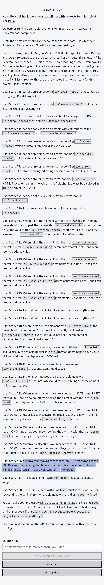
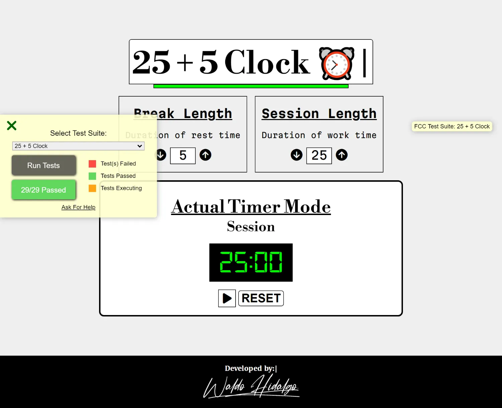
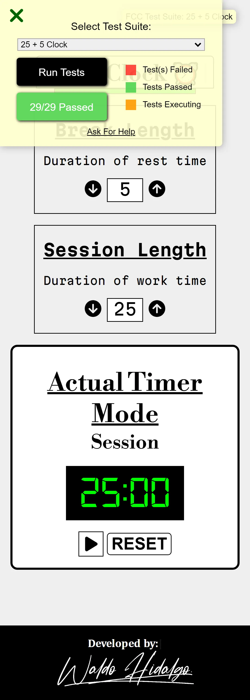
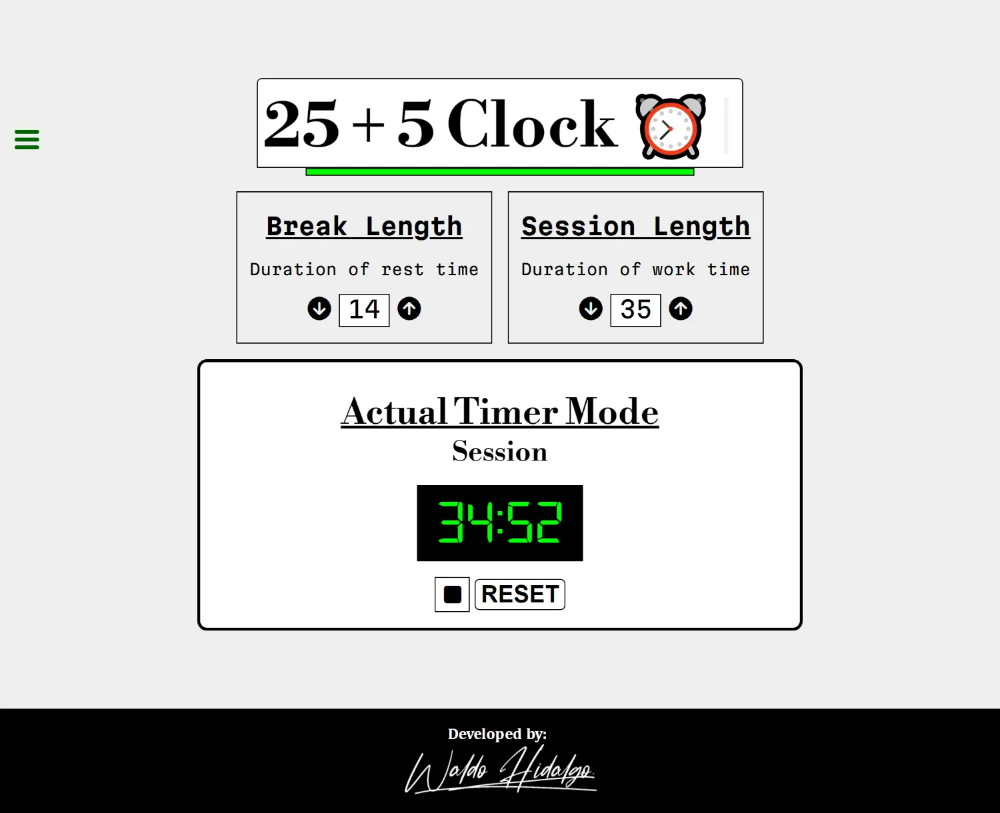

# My 25 + 5 Clock Project

Repositorio con el código solución al proyecto número 5 y último proyecto como requisito obligatorio para obtener la **Front End Development Libraries Certification** de [Freecodecamp](https://www.freecodecamp.org/learn/front-end-development-libraries/front-end-development-libraries-projects/build-a-25--5-clock).

Muestro mi proyecto con los **29 test** aprobados por completo.

## Librerias Utilizadas

| Tecnologías Utilizadas |
| ---------------------- |
| JQuery                 |
| SASS                   |
| Typewriter-effect      |

## Requsitos

## Proyecto Aprobado

### Pantallas Grandes

### Pantallas Small

## Proyecto en un estado cualquiera funcional

