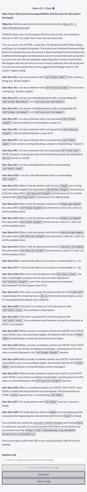
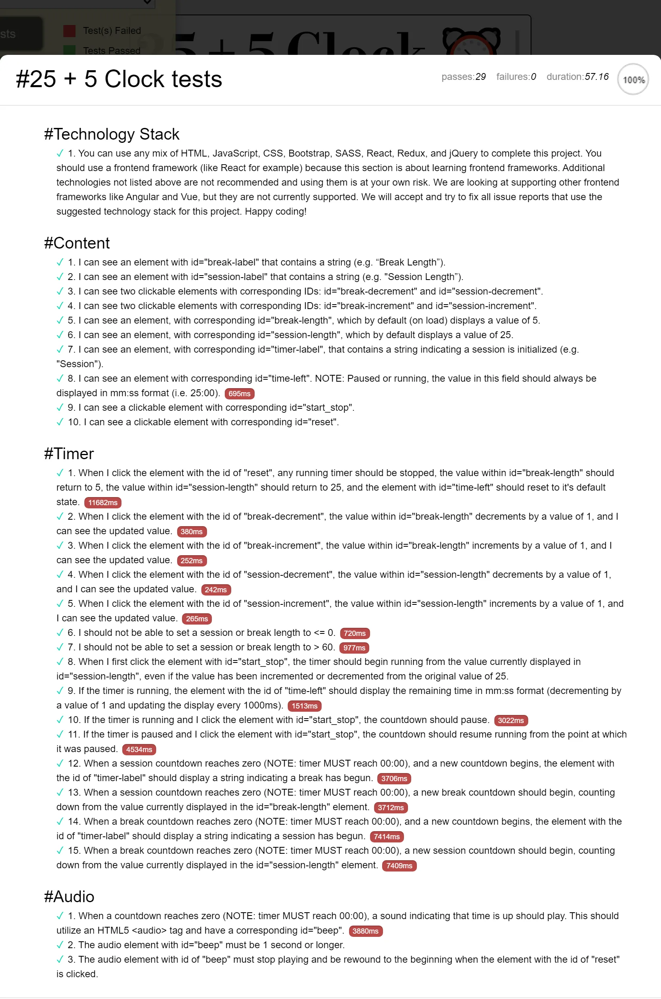

# My 25 + 5 Clock Project

Repositorio con el código solución al proyecto número 5 y último proyecto como requisito obligatorio para obtener la **Front End Development Libraries Certification** de [Freecodecamp](https://www.freecodecamp.org/learn/front-end-development-libraries/front-end-development-libraries-projects/build-a-25--5-clock).

Muestro mi proyecto con los **29 test** aprobados por completo.

## Tabla de Contenidos

- [My 25 + 5 Clock Project](#my-25--5-clock-project)
  - [Tabla de Contenidos](#tabla-de-contenidos)
  - [Librerias Utilizadas](#librerias-utilizadas)
  - [Requsitos](#requsitos)
  - [Proyecto Aprobado](#proyecto-aprobado)
    - [Pantallas Grandes](#pantallas-grandes)
    - [Pantallas Small](#pantallas-small)
  - [Todos los Test Aprobados](#todos-los-test-aprobados)
  - [Proyecto en un estado cualquiera funcional](#proyecto-en-un-estado-cualquiera-funcional)

## Librerias Utilizadas

| Tecnologías Utilizadas |
| ---------------------- |
| JQuery                 |
| SASS                   |
| Typewriter-effect      |

## Requsitos

## Proyecto Aprobado

### Pantallas Grandes

### Pantallas Small

## Todos los Test Aprobados

## Proyecto en un estado cualquiera funcional

